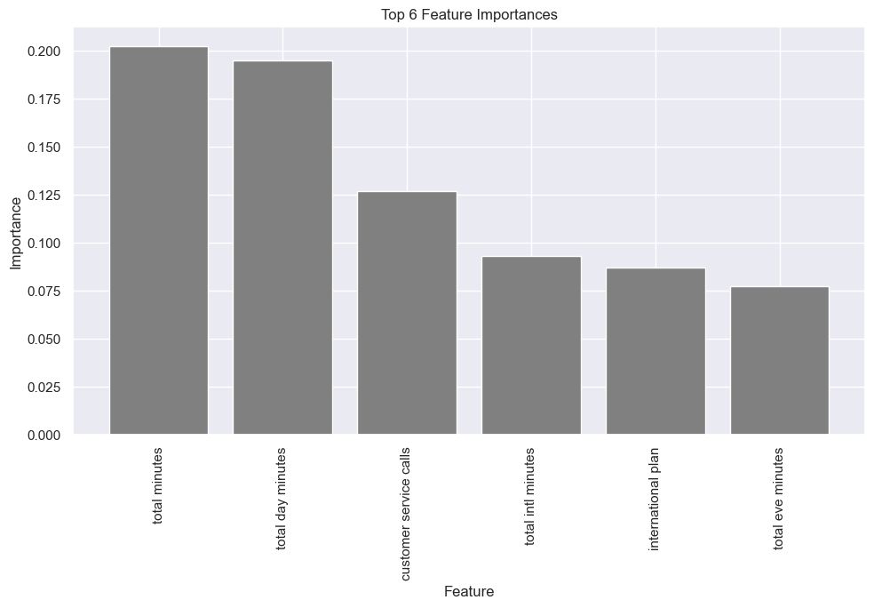
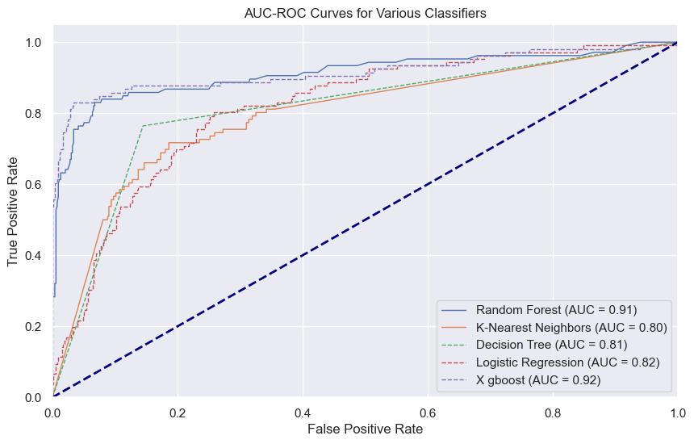

# Customer-Churn-Prediction
Repository for predicting customer churn with machine learning models. Includes data preparation, model training scripts, and performance evaluation

***
My notebook link:
[Notebook Link](https://github.com/Atieng/Customer-Churn-Prediction/blob/main/Customer-churn.ipynb).

[Presentation](Presentation.pdf)

## Project Overview

SyriaTel, a telecommunications company faces major issues in retaining its customers.SyriaTel Company has a high churn rate of 14.49% .This churn rate has reduced its revenue and also has made the comapny face very high competition from other Telecommunication companies. Due to this impact the company has hired me to analyse their past data and come up with business insights and new strategies of reducing the customer churn rate.The aim of this project is to analyze past data of SyriaTel telecommunication company and come up with machine learning algorithms to predict whether a customer will churn or not. By analyzing Syrial Tel past data, which includes customer information eg `account length`, charges per call, minutes the customer get from the company,International plan and voice mail plan,and past churn records. By identifying this patterns and major factors that contribute to a customer churning away from SyrialTel, I will be able to predict wether a customer is likely to churn or not. 

***

### Project Description
 This project is about analyzing Syria Tel historical data and building models that will predict wether a customer is likely to churn or not and what features contribute to customer churning away from the SyriaTel company.
 Main problems addressed by this project are:
 - Revenue loss by SyriaTel
 - Customer Dissatisfaction

#### Objectives of this project
This project aims to:
- Analyze SyriaTel's historical customer data which includes behavioral,minutes usage patterns,Charges inorder to predict wether a customer will churn or not
- Develop predictive models

***

### Data
>The dataset used for this analysis is from kaggle this is >the link 

[link here](https://www.kaggle.com/becksddf/churn-in-telecoms-dataset)

>The dataset is structured to include behavioral data, usage patterns, and demographic details, which are critical for understanding and predicting customer churn

### Data Summary
| columns | Rows | Data Types   | 
| -----   | ---- | ----         |
| 21      | 3333 | Bool, Integer, Strings| 

***

### Methodology used

#### Data Processing
>The processes taken in data processing is data cleaning; which includes checkng for null values, checking for duplicates, checking for outliers and removing them

### Explanatory Data Analysis
>Includes visualizations:

>I used Boxplots, Heatmap. Histogram, Countplot
### Modelling
>- Model Training
>- Model Selection
>- Hyperparameter Tuning

Models used:
- Logistic Regressor
- KNearest Neighbors
- Decison Tree Classifier
- Random Tree Classifier
- Xgboost

**Most Importance Feature**

**Model Performance**

Results for the Models

| Logistic Regressor | KNN | Decision Tree  | Random Forest | Xgboost|
| -----------------  | ----| -------------- | ------------  | ------ |
| 82%                | 80% |      81%       |     91%       |  92%   | 

### Conclusions

>- Model Performance: The XGBoost model achieved a high accuracy of approximately 94%, indicating that it performs well in predicting customer churn.
>- Important Features: The most important features identified by the model are `customer service calls`, `total minutes`, `total day minutes`, `total intl calls`, `total intl minutes`, and `total eve minutes`,`international plan`. These features play a crucial role in predicting whether a customer will churn or not.

### Recommendations

>- Focus on Customer Service: The number of customer service calls appears to be a significant predictor of churn. It's essential to pay attention to customer complaints and issues promptly to address their concerns and improve satisfaction.
>- Analyze Usage Patterns: Total usage minutes during different times of the day ('total day minutes', 'total eve minutes', 'total intl minutes') and the number of international calls ('total intl calls') can provide insights into customers' usage patterns. Analyzing these patterns can help tailor services and offers to meet their needs better.
 
>- Proactive Communication: Implement proactive communication strategies to engage with customers before they consider churning. This could include personalized emails, messages, or calls to check their satisfaction, offer assistance, or provide special promotions.
>- Continuous Monitoring: Continuously monitor customer behavior and feedback to identify emerging trends and adjust retention strategies accordingly. Regularly updating the model with new data and reevaluating feature importance can help maintain its predictive accuracy over time.
> By putting this recommendations in place the company which be able to reduce customer churn rates

### Next Steps

>- Monitor strategies, track churn, satisfaction, usage. Adjust based on insights, feedback, performance evaluation regularly.

>- Explore additional data sources or collect more data to enhance the predictive capabilities of the model. Refine the model by experimenting with different algorithms, hyperparameters, or feature engineering techniques to improve its performance.
 
>- Gather customer feedback regularly to improve services, create new offerings, and strengthen relationships. Use surveys, interviews, and feedback channels to understand needs, preferences, and enhance overall customer experience.

>-  Create a lasting plan for keeping customers by building strong relationships, encouraging loyalty, and providing great experiences. Use predictive analytics and machine learning to support long-term growth and stay ahead.

 

 